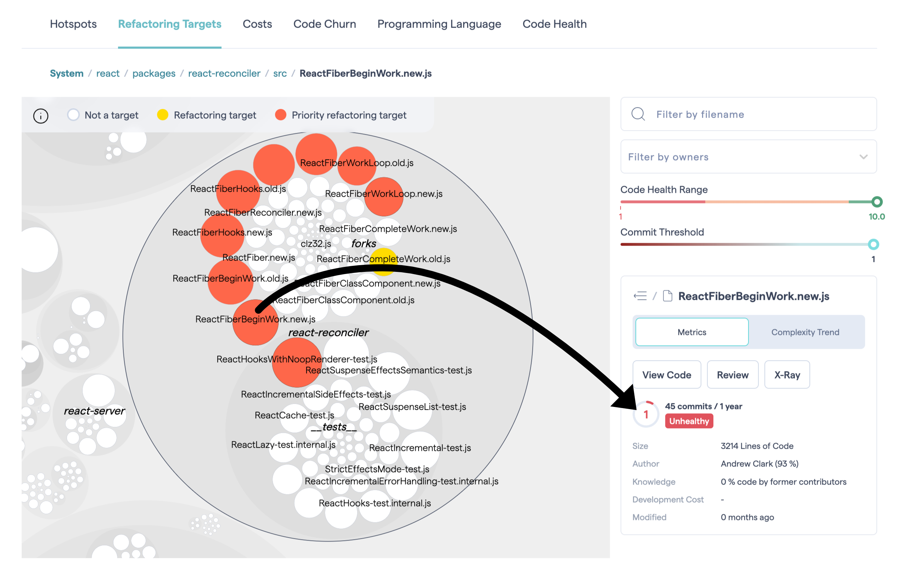
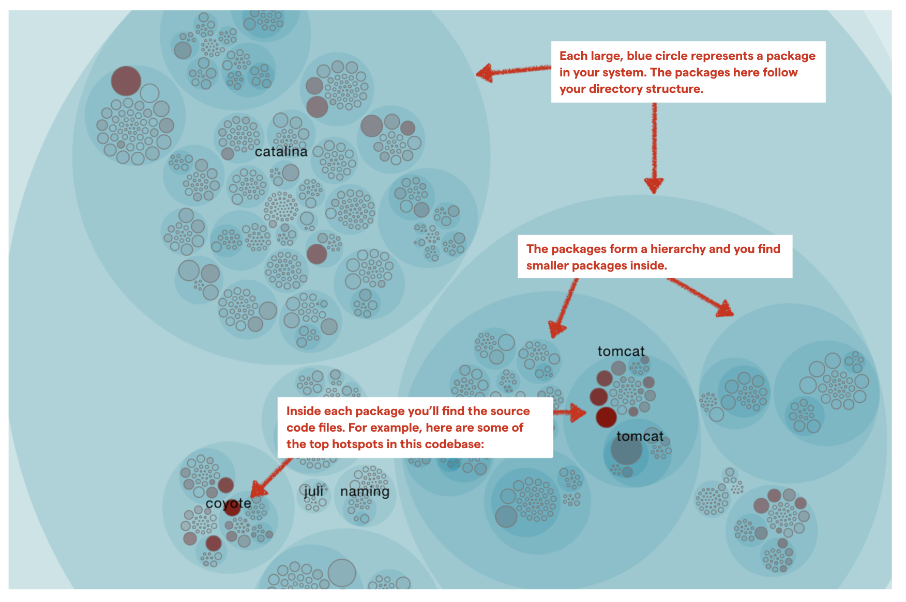

# Test Shield Service

## Overview

Test Shield is an innovative service that combines intelligent code analysis with modern test automation principles to create a comprehensive testing and code quality improvement strategy. By integrating Code Clinic capabilities with automated testing approaches, Test Shield helps organizations identify critical areas for refactoring while ensuring robust test coverage using modern test pyramid principles.

## Purpose

The Test Shield service addresses two critical challenges in software development:

1. Identifying and prioritizing areas of code that need improvement through refactoring
2. Implementing effective test automation strategies based on the modern test pyramid approach

Many organizations struggle with implementing comprehensive test automation, especially in legacy applications. The challenges often stem from:

- Code that wasn't designed with testability in mind
- Tightly coupled components making isolation difficult
- Lack of clear architectural boundaries
- Technical debt accumulation

Test Shield helps overcome these challenges by providing a data-driven approach to improving code quality and test coverage, ultimately leading to more maintainable and reliable software systems.

## Implementation

### 1. Architecture

Test Shield consists of two main components:

#### Code Analysis Engine

- Identifies hotspots in your codebase
- Calculates code health scores
- Determines refactoring targets
- Provides visualization of code complexity and dependencies
- Highlights architectural constraints affecting testability

The above visualization shows how Test Shield analyzes code health scores and identifies refactoring targets. Red areas indicate priority refactoring targets, while the metrics on the right provide detailed health indicators including:

- Code health range
- Commit threshold
- Lines of code
- Knowledge distribution
- Development cost

These metrics help prioritize which areas of the codebase need refactoring to improve testability and enable effective test automation.

#### Test Automation Framework

- Implements the modern test pyramid approach
- Provides comprehensive test coverage across all layers:
  - Unit Tests for business logic
  - Narrow Integration Tests for presentation and infrastructure
  - Component Tests for individual service testing
  - Contract Tests for service interactions
  - Acceptance Tests for system behavior
  - E2E Tests for critical paths
  - Smoke Tests for system health

Each layer of testing requires specific architectural characteristics to be effectively implemented. Test Shield helps identify where architectural improvements are needed to support these different types of tests.

### 2. Components

#### Analysis Components

- Hotspot Detection: Identifies areas of high complexity and frequent changes
- Code Health Assessment: Evaluates code quality metrics and trends
- Refactoring Target Identification: Prioritizes areas needing improvement
- Dependency Analysis: Maps system components and their interactions
- Testability Analysis: Evaluates code structure for test automation readiness

The hotspots augmented map above demonstrates how Test Shield visualizes your codebase:

- Large circles represent packages in your system
- Hierarchical structure shows package relationships
- Color intensity indicates areas requiring attention
- Size correlates with code complexity and change frequency

This visualization helps teams understand which components need architectural improvements to support effective test automation.

#### Testing Components

- Test Selection: Intelligent selection of test types based on code analysis
- Test Prioritization: Risk-based test prioritization
- Test Execution: Automated test execution across all layers
- Results Analysis: Comprehensive test coverage and quality metrics
- Testability Assessment: Guidance on necessary refactoring for test implementation

### 3. Integration

Test Shield seamlessly integrates with:

- Version Control Systems (Git)
- CI/CD Pipelines
- Code Analysis Tools
- Test Automation Frameworks
- Development Workflows

## Benefits

- Data-driven identification of refactoring targets
- Comprehensive test coverage using modern test pyramid principles
- Reduced technical debt through targeted improvements
- Early detection of code quality issues
- Improved system reliability and maintainability
- Efficient resource allocation for testing and refactoring efforts
- Clear roadmap for improving testability in legacy applications
- Prioritized approach to architectural improvements
- Reduced complexity in test automation implementation

## Best Practices

1. Regular code analysis to track trends and improvements
2. Balanced implementation of test types according to the modern test pyramid
3. Continuous monitoring of code health metrics
4. Iterative refinement of refactoring targets
5. Integration with development workflows for maximum effectiveness
6. Prioritize architectural improvements that enable better testing
7. Focus on modular design and loose coupling
8. Address technical debt that hinders test automation
9. Implement testability improvements incrementally

## Next Steps

1. [CodeScene Integration](./codescene.md)
2. [Quality Metrics](./quality-metrics.md)
3. [Modern Test Pyramid Implementation](./test-pyramid.md)
4. [Code Clinic Integration](./code-clinic.md)
