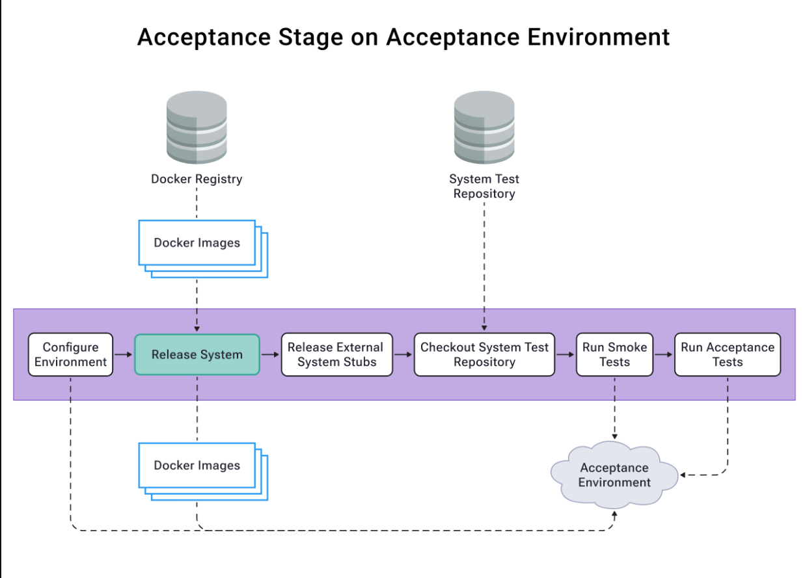
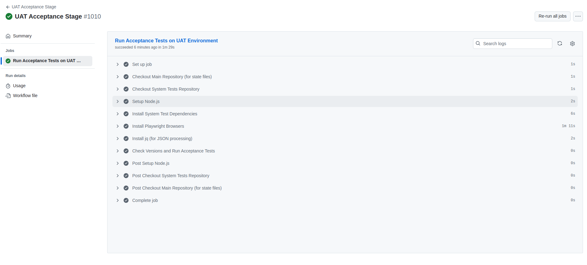

# Acceptance Stage

## Purpose

The Acceptance Stage is a crucial automated quality gate that validates whether the system meets business requirements and user expectations. It replaces traditional manual QA testing with automated acceptance tests, providing:

- Rapid feedback on system behavior (within 1 hour vs. days for manual testing)
- Consistent validation of business requirements
- Regression safety at the system level
- Enablement for Acceptance Test-Driven Development (ATDD)

As Dave Farley emphasizes, a 1-hour acceptance test cycle is acceptable and provides a significant improvement over manual QA that takes days. While manual testing gives confidence through human intuition, automated acceptance tests provide rapid, reliable feedback about system behavior from a business perspective.

## Architecture Overview



The acceptance stage runs on a dedicated acceptance environment, pulling:

- Docker images from the registry
- System tests from the test repository
- Configuration and state management

## Four-Layer Acceptance Test Model

Our acceptance tests follow a four-layer architecture that focuses on WHAT the system does rather than HOW it does it:

1. **Features Layer** (`/features`)

   - Business-readable scenarios in Gherkin
   - Describes system behavior from user's perspective
   - Serves as living documentation

2. **Step Definitions** (`/step_definitions`)

   - Bridges between Gherkin and DSL
   - Business-oriented language
   - No technical implementation details

3. **Domain-Specific Language** (`/dsl`)

   - Business-oriented abstraction layer
   - Encapsulates system interactions
   - Provides reusable business operations

4. **Drivers** (`/drivers`)
   - Technical implementation details
   - Handles system interaction mechanics
   - Isolates technical complexity

Benefits of this approach:

- Clear separation between WHAT and HOW
- Tests remain stable despite UI/technical changes
- Business stakeholders can understand and contribute
- Reduced maintenance overhead
- Improved test reliability

## Stage Components

### 1. Environment Setup

- Automated environment configuration
- State file management for version tracking
- Integration with Docker registry

### 2. System Tests

- Smoke tests for basic system health
- End-to-end acceptance tests
- Backend connectivity diagnostics
- State-based version tracking

### 3. Test Execution Strategy

### Smoke Tests First Approach

The term "smoke test" originates from electronics, where the first test was to power up a circuit and check if it smoked. In software, we apply the same principle:

- Run quick, high-level smoke tests before detailed acceptance tests
- Fail fast if basic system functionality is broken
- Avoid wasting time running full acceptance suite if system is fundamentally broken
- Provide rapid feedback about critical issues

Our implementation:

```yaml
# Smoke test execution
if ! npm run test:smoke --prefix ./system-tests-repo; then
    echo "Smoke tests FAILED - stopping here"
    exit 1 # Don't proceed to acceptance tests
fi

# Only run acceptance tests if smoke tests pass
npm run test:acceptance --prefix ./system-tests-repo
```

Benefits of this approach:

- Early detection of major issues (typically within 2-3 minutes)
- Resource optimization by preventing unnecessary test runs
- Quick feedback loop for critical failures
- Cost-effective test execution strategy

### Full Test Execution

- Scheduled runs every 15 minutes
- Concurrency management to prevent test overlap
- Version-based test triggering
- State persistence for test results

### 4. Quality Gates

- Smoke test suite passing
- Acceptance test suite passing
- Version state management
- Environment health checks

## Implementation

- Workflow: `digital-kudos-wall/.github/workflows/acceptance-stage-uat.yml`
- System Tests: `digital-kudos-wall-system-tests/src/acceptance`

### Example Successful Run



A successful acceptance stage run includes:

1. Environment setup and configuration
2. System test repository checkout
3. Test dependency installation
4. Version state management
5. Smoke test execution
6. Acceptance test execution
7. State file updates

## Test Execution Model

The acceptance stage follows a smart execution model:

1. Checks for newly deployed versions
2. Compares against last successfully tested versions
3. Only runs tests when versions change
4. Updates state files after successful runs
5. Maintains test history through state management

## Common Issues and Solutions

1. **Environment Stability**

   - Regular health checks
   - Automated environment reset
   - State-based version tracking

2. **Test Reliability**

   - Four-layer architecture reduces flakiness
   - Business-focused scenarios
   - Abstracted technical details

3. **Performance**
   - Parallel test execution
   - Smart test triggering
   - Efficient state management

## Next Steps

1. [UAT Stage](./uat-stage.md)
2. [Release Stage](./release-stage.md)
