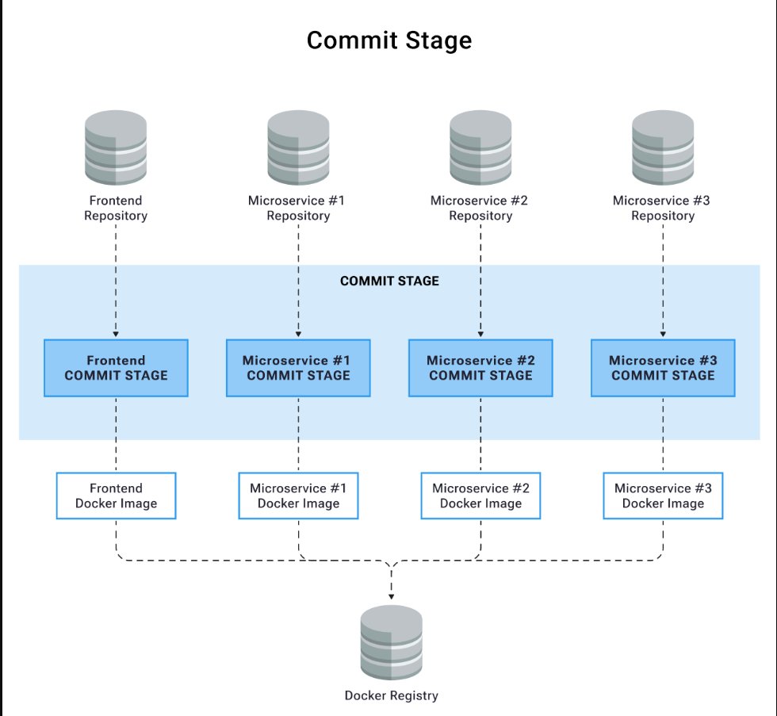
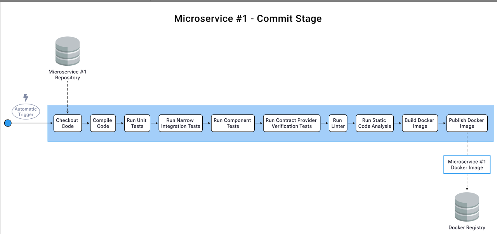
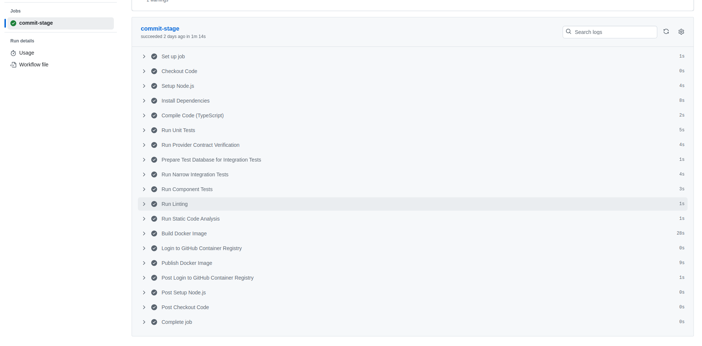

# Commit Stage

## Purpose

The Commit Stage is the foundation of our Continuous Integration (CI) pipeline, serving as the first automated quality gate for all code changes. It ensures that:

- Code compiles successfully across all components
- All tests pass at various levels
- Code meets quality and security standards
- Deployable artifacts are produced consistently

As highlighted in modern engineering practices, having an automated Commit Stage is crucial for effective Test-Driven Development (TDD) and prevents the "it works on my machine" syndrome.

## Architecture Overview

Our system consists of multiple components, each with its own Commit Stage pipeline:

## Stage Components

### 1. Code Checkout

- Automated checkout from Git repository
- Triggered on:
  - Push to main branch
  - Pull request creation/update
  - Manual workflow dispatch (for contract testing)

### 2. Environment Setup

- Node.js 18 environment configuration
- Dependency installation using `npm ci` for reproducible builds
- Cache configuration for improved performance

### 3. Compilation

- TypeScript compilation for both frontend and backend
- Build verification
- Type checking

### 4. Testing Layers

#### Unit Tests

- Jest-based unit testing
- Code coverage reporting
- Focused on business logic and component behavior

#### Narrow Integration Tests (Backend)

- Database integration testing
- External service integration verification
- Uses isolated test database

#### Component Tests

- Testing components in isolation
- Verifying component behavior and integration
- Frontend and backend specific test suites

#### Contract Tests

- Consumer-driven contract testing using Pact
- Contract publication to Pact Broker
- Provider contract verification
- Ensures API compatibility between services

### 5. Static Analysis

- ESLint for code quality checks
- TypeScript type checking
- Style consistency verification
- Security vulnerability scanning
- Dependency analysis

### 6. Docker Build

- Multi-stage Docker builds for optimized images
- Image tagging with commit SHA and latest
- Security scanning of container images

### 7. Artifact Publishing

- Docker image publication to GitHub Container Registry
- Versioned artifacts for traceability
- Automated publishing on main branch commits

## Quality Gates

The Commit Stage enforces several quality gates:

1. **Build Success**

   - Clean compilation
   - No TypeScript errors

2. **Test Coverage**

   - All test suites must pass
   - Coverage thresholds met

3. **Code Quality**

   - No linting errors
   - Passing static analysis

4. **Contract Verification**
   - Valid consumer contracts
   - Provider verification success

## Implementation

Our Commit Stage is implemented using GitHub Actions workflows:

- Frontend: `digital-kudos-wall-frontend/.github/workflows/commit-stage.yml`
- Backend: `digital-kudos-wall-backend/.github/workflows/commit-stage.yml`

### Example Successful Run

A successful commit stage run executes all steps in sequence:

1. **Setup (1s)**: Initial job setup
2. **Code Checkout (8s)**: Fetching code from repository
3. **Node.js Setup (4s)**: Configuring Node.js environment
4. **Dependencies (8s)**: Installing npm packages
5. **TypeScript Compilation (2s)**: Building the code
6. **Unit Tests (5s)**: Running unit test suite
7. **Contract Tests (4s)**: Verifying API contracts
8. **Database Preparation (1s)**: Setting up test database
9. **Integration Tests (4s)**: Running integration tests
10. **Component Tests (3s)**: Executing component tests
11. **Linting (1s)**: Code style verification
12. **Static Analysis (1s)**: Code quality checks
13. **Docker Build (28s)**: Building container image
14. **Registry Login (8s)**: Authenticating with container registry
15. **Image Publishing (8s)**: Publishing Docker images
16. **Post-steps (1-8s)**: Cleanup and finalization

Total pipeline execution time: ~1m 14s

This efficient execution time is achieved through:

- Optimized dependency caching
- Parallel test execution where possible
- Efficient Docker layer caching
- Minimal test database setup

## Common Issues and Solutions

1. **Flaky Tests**

   - Implement retry mechanisms
   - Isolate test environments
   - Use deterministic test data

2. **Build Performance**

   - Optimize dependency caching
   - Parallel test execution
   - Efficient Docker layer caching

3. **Contract Testing**
   - Ensure Pact Broker availability
   - Maintain contract versioning
   - Handle provider state setup

## Next Steps

1. [Acceptance Stage](./acceptance-stage.md)
2. [Advanced Topics](../advanced/test-shield.md)
