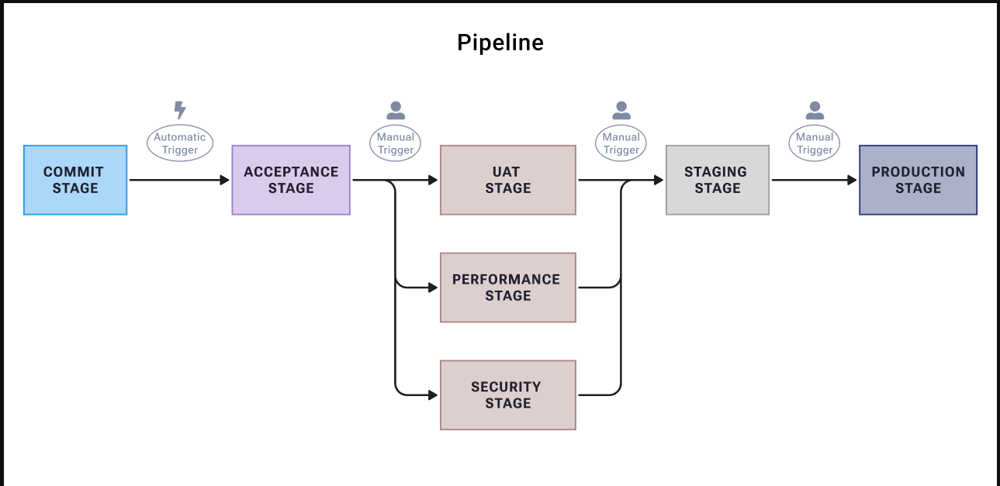

# Pipeline Overview

## Pipeline Philosophy

Our pipeline implementation follows core principles of Continuous Delivery (CD) to ensure reliable, repeatable, and efficient software delivery. The pipeline serves as the foundation for:

- Automated testing at multiple levels
- Consistent deployment across environments
- Early detection of integration issues
- Rapid feedback loops for developers
- Quality gates to ensure production readiness

## Pipeline Stages

Our pipeline consists of several stages with specific triggers:

- **Commit Stage**: Automatically triggered on code commits
- **Acceptance Stage**: Automatically triggered after successful commit stage
- **Parallel Stages**:
  - UAT Stage (Manual trigger)
  - Performance Stage (Manual trigger)
  - Security Stage (Manual trigger)
- **Staging Stage**: Manual trigger after parallel stages complete
- **Production Stage**: Manual trigger with approval

## Stage Descriptions

### Commit Stage

The first automated stage triggered by code commits. It includes:

- Component Level Tests (Unit Tests, Integration Tests)
- Code Quality Checks
- Security Scans
- Docker Image Building and Publishing

### Acceptance Stage

Validates system behavior through:

- Automated Deployment to Acceptance Environment
- Smoke Tests
- Acceptance Tests

### UAT Stage

Environment for manual testing:

- Automated Deployment to UAT Environment
- Smoke Tests
- Manual QA Testing
- User Acceptance Testing

### Performance Stage

Validates non-functional requirements:

- Load Testing
- Stress Testing
- Scalability Testing
- Resource Utilization Analysis

### Security Stage

Ensures system security:

- Security Scanning
- Penetration Testing
- Vulnerability Assessment
- Compliance Checks

### Staging Stage

Production-like environment for final validation:

- Production-like Configuration
- Final Integration Testing
- Pre-production Verification

### Production Stage

Final deployment stage:

- Blue-Green Deployment
- Canary Releases
- Production Monitoring
- Post-deployment Verification

## Quality Gates

Each stage implements specific quality gates that must be passed before proceeding:

1. **Commit Stage Gates**

   - All tests passing
   - Code coverage thresholds met
   - No critical security vulnerabilities
   - Code quality metrics within acceptable ranges

2. **Acceptance Stage Gates**

   - All acceptance tests passing
   - API contract tests successful
   - System integration verified

3. **Environment-specific Gates**
   - Smoke tests passing
   - Environment health checks
   - Required approvals obtained

## Pipeline Metrics

We track the following key metrics to measure pipeline effectiveness:

- **Lead Time**: Time from commit to production deployment
- **Cycle Time**: Time from work start to completion
- **Deployment Frequency**: How often we deploy to production
- **Change Failure Rate**: Percentage of deployments causing failures
- **MTTR**: Mean time to recovery from failures

## Implementation Tools

Our pipeline leverages modern tooling for efficient delivery:

- **Version Control**: Git
- **CI/CD Platform**: GitHub Actions
- **Container Registry**: GitHub Container Registry
- **Testing Frameworks**: Jest, Cucumber, Playwright, Pact

## Next Steps

1. [Commit Stage](./commit-stage.md)
2. [Acceptance Stage](./acceptance-stage.md)
3. [UAT Stage](./uat-stage.md)
4. [Performance Stage](./performance-stage.md)
5. [Security Stage](./security-stage.md)
6. [Staging Stage](./staging-stage.md)
7. [Production Stage](./production-stage.md)
