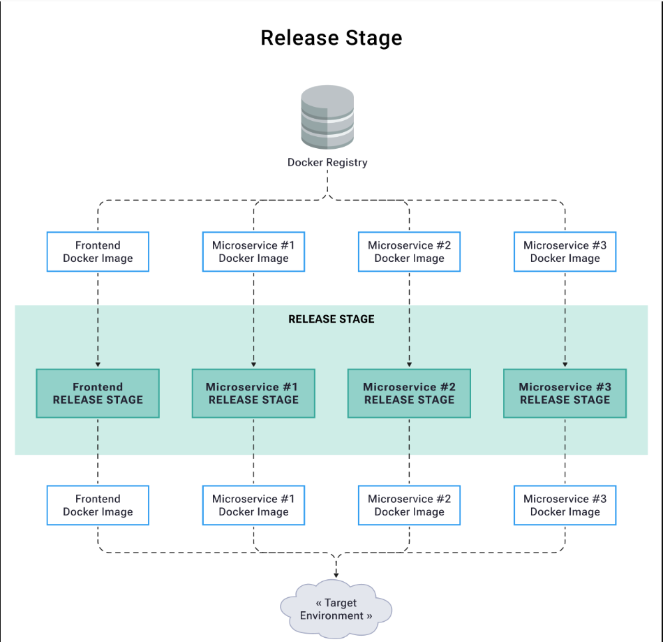

# Release Stage

## Purpose

The Release Stage automates the deployment process to target environments, eliminating manual interventions and ensuring reliable, repeatable releases. This stage:

- Replaces error-prone manual deployments
- Enables rapid and reliable releases
- Supports continuous delivery practices
- Provides consistent environment configuration
- Ensures system stability through automated verification

## Architecture Overview



The release stage orchestrates:

- Docker image retrieval from registry
- Environment-specific configuration
- Automated deployment process
- Post-deployment verification

## Stage Components

### 1. Pre-deployment Verification

- Contract compatibility checks via Pact Broker
- Version state verification
- Environment readiness checks
- Infrastructure validation

### 2. Deployment Process

- Container orchestration with Docker Compose
- Environment-specific configurations
- Health check mechanisms

### 3. Environment Management

- Infrastructure as Code principles
- Secret management
- Database migrations
- Configuration management
- Volume management for persistence

### 4. Post-deployment Verification

- Container health checks
- Service connectivity verification
- Database migration validation
- Basic smoke testing

## Contract Verification Strategy

### Can I Deploy Check

The release stage implements a crucial "Can I Deploy" check before any deployment:

- Verifies if the frontend (consumer) version is compatible with the backend (provider)
- Provides early feedback about contract compatibility
- Prevents deployments that would break service interactions
- Maintains system stability across microservices

Example implementation:

```yaml
- name: Can I deploy frontend?
  run: |
    pact-broker can-i-deploy \
      --pacticipant digital-kudos-wall-frontend \
      --version ${{ github.event.inputs.frontend_image_tag }} \
      --to-environment uat
```

### Automated Contract Verification

Our implementation includes automated webhook-triggered verification:

1. **Consumer Contract Changes**

   - Frontend pushes new contract to Pact Broker
   - Webhook automatically triggers backend verification workflow
   - Quick feedback on provider contract satisfaction
   - Early detection of breaking changes

2. **Provider Changes**

   - Backend changes trigger verification against all consumer contracts
   - Ensures changes don't break existing consumers
   - Particularly valuable in multi-consumer scenarios
   - Provides confidence in backward compatibility

3. **Benefits in Microservices Architecture**
   - Manages complex service dependencies
   - Prevents integration issues before deployment
   - Supports independent service evolution
   - Enables safe contract changes

### Version Management and Recording

After successful deployment:

- Records deployment in Pact Broker
- Updates environment state
- Maintains deployment history
- Enables version tracking across environments

## Implementation

- Release Workflow: `digital-kudos-wall/.github/workflows/release-uat.yml`

The workflow includes:

1. Pre-deployment contract verification
2. Environment setup and configuration
3. Container deployment and orchestration
4. Health checks and verification
5. State management and recording

## Release Strategy

### Version Management

```yaml
frontend_image_tag:
  description: "Frontend Docker image tag (commit SHA or tag)"
  required: true
  default: "latest"
backend_image_tag:
  description: "Backend Docker image tag (commit SHA or tag)"
  required: true
  default: "latest"
```

### State Management

- Version tracking in state files
- Deployment recording in Pact Broker
- Environment state persistence

## Quality Gates

1. **Contract Verification**

   - Consumer contract compatibility
   - Provider verification status
   - Version compatibility checks

2. **Deployment Health**

   - Container health status
   - Service connectivity
   - Database migration success
   - Basic functionality verification

3. **Environment State**
   - Configuration validation
   - Resource availability
   - Security compliance

## Common Issues and Solutions

1. **Database Migration Issues**

   - Automated migration scripts
   - Version control for schemas
   - Rollback procedures

2. **Container Health**

   - Health check implementation
   - Retry mechanisms
   - Logging and monitoring

3. **Network Issues**
   - Service discovery
   - Network isolation
   - Port mapping

## Next Steps

1. [Advanced Topics](../advanced/test-shield.md)
2. [Quality Metrics](../advanced/quality-metrics.md)
