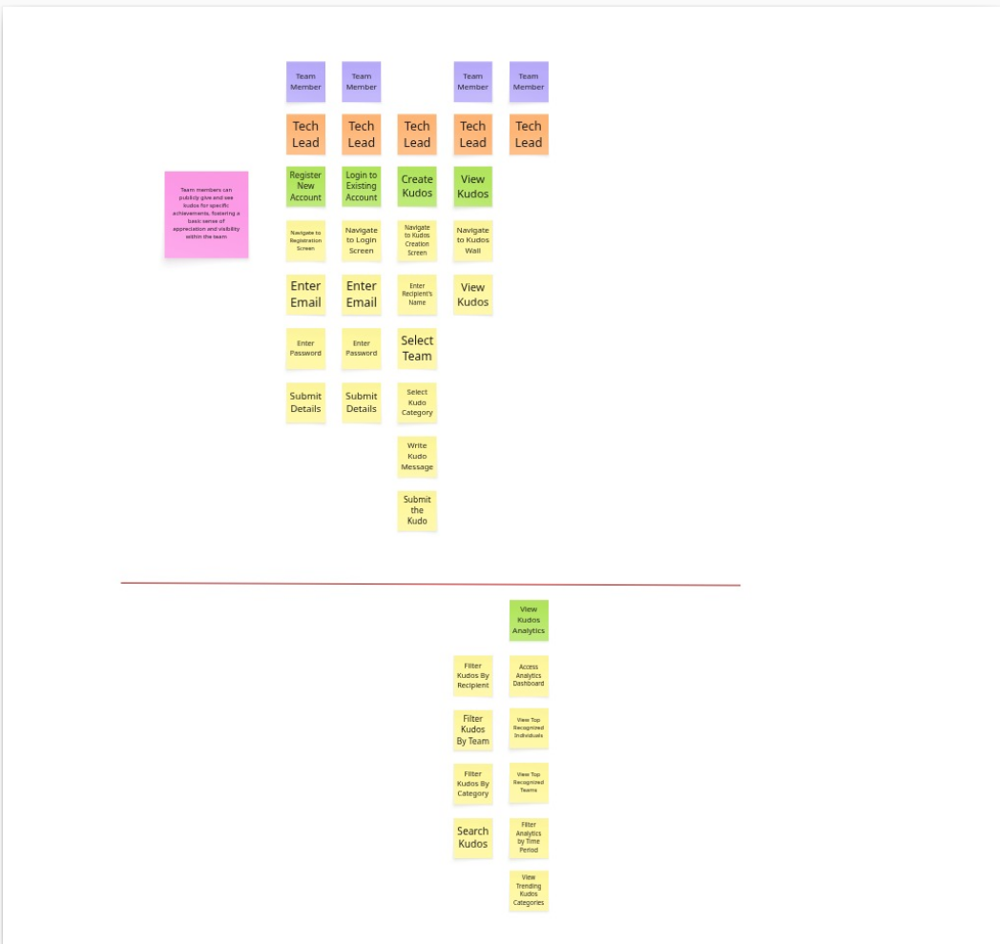

# CD Sandbox Project Overview

While code katas are useful for learning basic practices, they often fall short in demonstrating real-world software development complexities. As highlighted in industry discussions, developers need more than just basic exercises - they need to understand how practices like TDD, CI/CD, and Clean Architecture work in real-world scenarios with actual user stories, multiple architectural layers, and complex infrastructure.

## For Example Why TDD Katas don't work

A common approach to learning TDD is using TDD Katas. TDD Katas are simple exercises to help us practice TDD. If you're completely new to TDD, popular katas include:

1. [Bowling Game Kata][bowling]
2. [FizzBuzz][fizzbuzz]
3. [Tennis Kata][tennis]

[bowling]: https://beta.cyber-dojo.org/kata/edit/y2Xw9u
[fizzbuzz]: https://beta.cyber-dojo.org/kata/edit/bb91Nt
[tennis]: https://beta.cyber-dojo.org/kata/edit/qKrvLJ

TDD Katas are useful. They highlight the core principles of the TDD Red-Green-Refactor cycle:

- Writing the test before the code
- Writing minimal code, just enough to make the test pass
- Refactoring to make the code cleaner

The TDD Katas help us work incrementally & iteratively. They’re good for Learning Hours, because you can easily time-box these exercises.

## But TDD Katas don't translate to real-life practice

The problem with TDD Katas is that they only illustrate the lowest-level inner-most TDD cycle. At this lowest level, we jump straight into writing a Unit Test & using it to implement some classes, we jump right into implementing Business Logic.

However, when developers try to apply TDD, they have the following questions:

- How do we use TDD to implement the UI? Or is TDD just for Business Logic?
- How do we use TDD to implement the REST API? Or does TDD ignore the REST API?
- How do we deal with Databases? Or do we ignore Databases because it's just I/O?
- How do we deal with Microservices? Or do we just ignore Microservices with TDD?
- How do we deal with External Systems? Or do we ignore it because it's just I/O?

How does TDD relate to our real-life workflow:

- When we get a User Story, how do we apply TDD?
- When we get a Bug, how do we apply TDD?

Those are the questions that many developers ask themselves.

Unfortunately, TDD Katas do NOT provide answers to those questions. TDD Katas have a very narrow focus. They use TDD at the unit test level to implement business logic in classes and methods. They ignore everything else. They do not answer how to handle UIs, REST APIs, databases, microservices, or external systems.

You must go beyond TDD Katas. They only show you TDD at the Unit Test Level. You won't learn the bigger picture. You won't learn how to start with User Stories and Bugs. You won't learn how to apply TDD at the Acceptance and Component Test Levels.

This sandbox project addresses these limitations by showing how to apply TDD and other XP and CD practices across the system. The Digital Kudos Wall project serves as a comprehensive CD sandbox - bridging the gap between simple katas and production applications. It demonstrates how to handle real challenges that katas can't address: working with UIs, REST APIs, databases, microservices, and external systems, all while maintaining high-quality engineering practices.

## Project Purpose

### Learning and Implementation

The CD sandbox project demonstrates:

1. How to implement XP and CD practices in a real-world context, going beyond basic katas
2. End-to-end development workflow - from user stories to production deployment
3. Complete CI/CD pipeline implementation
4. Clean Architecture principles applied to both frontend and backend systems
5. Modern testing practices based on the Modern Test Pyramid
6. Standards and SOPs for scaling engineering practices in team environments

### Strategic Solutions

The project also serves as a foundation for two key strategic initiatives:

#### 1. Test Shield Service

- Intelligent code analysis for identifying refactoring targets
- Modern test pyramid implementation across all layers
- Code health assessment and visualization
- Testability analysis and improvement recommendations
- Integration with development workflows and CI/CD pipelines
- Data-driven approach to improving code quality and test coverage

#### 2. Engineering Excellence Academy Support

- Practical implementation examples for XP and CD practices
- Real-world sandbox environment for hands-on learning
- Implementation templates for engineering teams
- Reference architecture for clean code practices
- Demonstration platform for engineering excellence principles
- Support for various roles from Senior Engineers to CTOs

## User Story Map

The Digital Kudos Wall project started with a collaborative user story mapping session to create shared understanding and define the MVP scope. The story map helps visualize:

- The end-to-end user journey
- Core user activities and tasks
- MVP feature scope
- Future enhancements and iterations

You can view our user story map below:



[📥 Download User Story Map PDF](../images/user-story-map.pdf)

For more details about user story mapping and how we use it in our process, see our [Product Discovery Practices](../foundation/product-discovery.md) guide.

## Project Structure

The project is organized into multiple repositories, each with a specific purpose:

```
digital-kudos-wall/              # Main repository
├── docs/                        # Documentation
│   └── user-story-map.pdf      # Collaboration artifact
├── .github/workflows/          # CD Pipeline definitions
│   ├── release-uat.yml        # UAT deployment
│   ├── acceptance-stage-uat.yml # UAT testing
│   └── update-dashboard.yml   # Status updates
└── IMPLEMENTATION_PLAN.md      # Implementation guidelines

digital-kudos-wall-frontend/     # React frontend
├── docs/
│   ├── architecture/          # Clean Architecture guidelines
│   └── testing/              # Frontend testing SOPs

digital-kudos-wall-backend/      # Node.js backend
├── docs/
│   └── testing/              # Backend testing SOPs
└── .github/workflows/
    └── commit-stage.yml      # Commit stage pipeline

digital-kudos-wall-system-tests/ # System-level tests
├── docs/
│   ├── SOP-AcceptanceTests.md
│   └── SOP-SmokeTests.md
└── src/
    └── acceptance/           # Acceptance test suites

digital-kudos-wall-infrastructure/ # Infrastructure code
└── environments/            # Environment definitions
```

### Real-world Workflow

The project demonstrates TDD application in actual scenarios:

- Starting from a user story
- Breaking down requirements into testable chunks
- Implementing features incrementally
- Handling bug fixes with regression tests

This comprehensive approach ensures developers understand how to apply TDD beyond simple katas, addressing real-world challenges in modern software development.

## Technical Implementation

### Clean Architecture

The project implements Clean Architecture principles across all layers, demonstrating real-world application:

Frontend (React):

- Separation of UI components from business logic
- State management with clear boundaries
- Component composition and reusability
- Integration with backend services

Backend (Node.js):

- Domain-driven design with clear use cases
- REST API implementation following best practices
- Database abstraction and migration patterns
- External service integration patterns

Common principles across all layers:

- Clear separation of concerns
- Use case driven development
- Infrastructure independence
- Testability by design

### Testing Strategy

Implements a comprehensive testing approach that covers all architectural layers. For more details about testing strategy, see [Test Strategy](./test-strategy.md).

### CD Pipeline Implementation

A complete CD pipeline demonstrating:

1. **Commit Stage**

   - Fast feedback
   - Code quality checks
   - Unit and component tests
   - Contract verification

2. **Acceptance Stage**

   - System test execution
   - Integration validation
   - Performance checks

3. **UAT Stage**

   - Automated deployment
   - Environment management
   - Smoke test verification

4. **Release Stage**
   - Production deployment
   - Infrastructure management
   - Monitoring integration

## Standards and Practices

The project includes comprehensive Standard Operating Procedures (SOPs):

1. **Testing SOPs**

   - SOP-SociableUnitTests
   - SOP-ComponentTests
   - SOP-ContractTests
   - SOP-TestDataManagement
   - SOP-AcceptanceTests
   - SOP-SmokeTests

2. **Architecture SOPs**
   - SOP-Frontend-Clean-Architecture
   - Backend Clean Architecture guidelines

## Learning Path

This sandbox project serves as a learning tool:

1. Start with understanding XP and CD fundamentals
2. Study the implementation plan and architecture
3. Examine the testing strategy and SOPs
4. Explore the CD pipeline implementation
5. Practice implementing features following the guidelines

## Next Steps

1. [Test Strategy](./test-strategy.md) - Comprehensive testing approach
2. [Pipeline Overview](../pipeline/overview.md) - CD pipeline details
